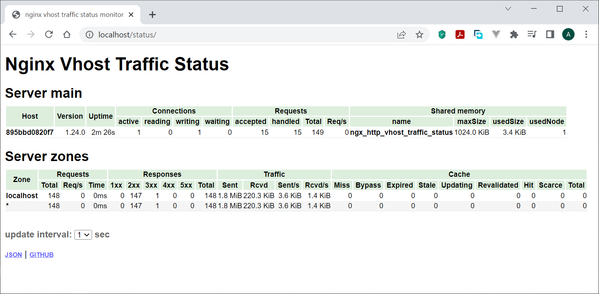

# Сборка Nginx с модулями в Docker

Проект предназначен для подготовки контейнеризованного `nginx` с модулями, на основе только исходного кода и официальных образов Docker. В данном репозитории продемонстрировано добавление модуля [nginx-module-vts](https://github.com/vozlt/nginx-module-vts), предназначенного для получения метрик `nginx`, в т.ч. для `prometheus`. Однако приведённые подходы позволяют собирать контейнеры `nginx` с любыми модулями, как динамическими (обе приведённых методики), так и подключаемыми при сборке ([Методика 2](#2-сборка-nginx-и-модулей-совместно-в-одном-контейнере-из-исходного-кода)).



## Оглавление

- [Nginx с модулями в Docker](#nginx-с-модулями-в-docker-репозиторий-в-процессе-наполнения)
  - [Оглавление](#оглавление)
  - [Содержание репозитория](#содержание-репозитория)
  - [Методики](#методики)
    - [1. Сборка динамического модуля в отдельном контейнере и перенос в контейнер nginx](#1-сборка-динамического-модуля-в-отдельном-контейнере-и-перенос-в-контейнер-nginx)
      - [Инструкция](#инструкция)
    - [2. Сборка nginx и модулей совместно в одном контейнере из исходного кода](#2-сборка-nginx-и-модулей-совместно-в-одном-контейнере-из-исходного-кода)
      - [Инструкция](#инструкция-1)
- [Диагностика и устранение неисправностей](#диагностика-и-устранение-неисправностей)
- [TODO](#todo)
- [Источники](#источники)

## Содержание репозитория

- `build_separate` - каталог с `Dockerfile`'ами для сборки динамического модуля и `nginx` в отдельных контейнерах ([Методика 1](#1-сборка-динамического-модуля-в-отдельном-контейнере-и-перенос-в-контейнер-nginx)).
- `build_with_nginx` - каталог с `Dockerfile`'ом для сборки только `nginx` с модулем в одном контейнере ([Методика 2](#2-сборка-nginx-и-модулей-совместно-в-одном-контейнере-из-исходного-кода)).

## Методики

### 1. Сборка динамического модуля в отдельном контейнере и перенос в контейнер nginx

1. Запустить контейнер из образа той ОС, в которой будет работать nginx (alpine или debian).
2. Скачать в контейнер исходный код той версии nginx, для которой необходимо собрать модуль.
3. Скачать исходный код модуля и необходимые пакеты для сборки.
4. Сконфигурировать исходники `nginx`

   ```bash
   ./configure --with-compat --add-dynamic-module=../путь_к/   исходному/коду_модуля
   ```

   и собрать модуль с помощью `make modules`.
5. Извлечь собранный модуль из контейнера и перенести в контейнер `nginx` в `/etc/nginx/modules`.
6. Внести в контейнере `nginx` прочие изменения согласно инструкции к модулю (например, в файле `/etc/nginx/nginx.conf`).

Преимущества этого подхода:

- нет необходимости воспроизводить процесс сборки (и компактирования) всего контейнера `nginx`, можно взять компактный официальный образ `nginx` и лишь дополнить его собранным модулем,
- действия просты по отдельности и не требуют высокой экспертизы.

Недостатки:

- необходимо соблюдать синхронность версий `nginx` и  зависимостей в целевом и сборочном контейнерах,
- требуются манипуляции по выгрузке собранного модуля  из сборочного контейнера и загрузке на целевой контейнер.

#### Инструкция

1. Перейти в каталог `build_separate`. Собрать модуль в отедльном образе и вывести на хост.

    ```bash
    sudo docker build -f Dockerfile.build_module -t ornstein89/temp-build-image --output ./build .
    ```

    WSL (*Windows + WSL2 + Docker desktop*):

    ```bash
    docker.exe build -f Dockerfile.build_module -t ornstein89/temp-build-image --output ./build .
    ```

2. Убедиться, что в каталоге `build` хоста появился собранный файл модуля.
3. Удалить сборочный образ (> 300 Мб).

    Ubuntu:

    ```bash
    sudo docker rmi ornstein89/temp-build-image
    ```

    WSL (*Windows + WSL2 + Docker desktop*):

    ```bash
    docker.exe rmi ornstein89/temp-build-image
    ```

4. Собрать образ `nginx` (**той же версии nginx и той же версии linux, в данном репозитории - `1.24.0-alpine`**), при сборке в него добавляются собранный динамический модуль, модифицированный `nginx.conf` (добавлены строки `load_module ...;` и `vhost_traffic_status_zone;`) а также `default.conf` (URI для выдачи статистики).

    Ubuntu:

    ```bash
    sudo docker build -t ornstein89/nginx_with_modules .
    ```

    WSL (*Windows + WSL2 + Docker desktop*):

    ```bash
    docker.exe build -t ornstein89/nginx_with_modules .
    ```

5. Запустить контейнер из собранного образа `nginx`, проверить доступность статистики по URL <http://localhost/status>.

    Ubuntu:

    ```bash
    sudo docker run --name nginx_with_modules -p 80:80 -p 443:443 ornstein89/nginx_with_modules
    ```

    WSL (*Windows + WSL2 + Docker desktop*):

    ```bash
    docker.exe run --name nginx_with_modules -p 80:80 -p 443:443 ornstein89/nginx_with_modules
    ```

### 2. Сборка nginx и модулей совместно в одном контейнере из исходного кода

Преимущества этого подхода:

- меньшее количество манипуляций, нет необходимости переносить файлы из одного контейнера в другой, сразу получается контейнер с `nginx` и установленным модулем.

Недостатки:

- при сборке `nginx` из исходного кода сложно обеспечить компактность контейнера, сравнимую с официальными сборками; требуется либо высокая экспертность в дистрибутивах `linux` и зависимостях `nginx`, либо строить свой `Dockerfile` на основе `Dockerfile`'ов официальных сборок.

#### Инструкция

1. Перейти в каталог `build_with_nginx`. В `Dockerfile` в переменной `NGINX_BUILD_VERSION` задать желаемую версию `nginx` (на 30 апреля 2023 года - версия `1.24.0`).

2. Сборка образа `nginx` с модулем.

    Ubuntu:

    ```bash
    sudo docker build -t ornstein89/alpine-nginx-modules .
    ```

    WSL (*Windows + WSL2 + Docker desktop*):

    ```bash
    docker.exe build -t ornstein89/alpine-nginx-modules .
    ```

3. Запуск. Убедиться, что статистика, выдаваемая модулем `nginx-module-vts`, доступна по URL <http://localhost/status>.

    Ubuntu:

    ```bash
    sudo docker run --name alpine-nginx-modules ornstein89/alpine-nginx-modules
    ```

    WSL (*Windows + WSL2 + Docker desktop*):

    ```bash
    docker.exe run --name alpine-nginx-modules ornstein89/alpine-nginx-modules
    ```

# Диагностика и устранение неисправностей

1. Диагностический запуск с переходом в терминал контейнера:

    Ubuntu:

    ```bash
    sudo docker run --name alpine-nginx-modules -a stdin -a stdout -it ornstein89/alpine-nginx-modules sh
    ```

    WSL (*Windows + WSL2 + Docker desktop*):

    ```bash
    docker.exe run --name alpine-nginx-modules -a stdin -a stdout -it ornstein89/alpine-nginx-modules sh
    ```

# TODO

- [x] Использовать `apk --virtual NAME add && apk del NAME` для уменьшения объёма (350Мб → 100Мб).
- [x] Собирать динамический модуль на отдельном контейнере, а затем перенести на контейнер `nginx`.
- [ ] Multi-stage build для метода 1.
- [ ] Метод 2, перейти на основу из <https://github.com/nginxinc/docker-nginx> и <https://hg.nginx.org/pkg-oss/>, сократить объём образа.
- [ ] Internationalization.
- [ ] Compose для метода 1.

# Источники

- Решение проблем с отсутствием библиотек на alpine <https://artem.services/?p=1093>.
- Сборка nginx <https://stackoverflow.com/questions/60324262/compiling-nginx-on-alpine-linux-3-11>.
- Сборка nginx <https://github.com/LoicMahieu/alpine-nginx>.
- Документация по конфигурированию и сборке `nginx` из исходников <https://nginx.org/en/docs/configure.html>.
- Сборка модуля и nginx в одном контейнере <https://wiki.hydra-billing.ru/pages/viewpage.action?pageId=69173413>.
- Сборка динамического модуля <https://habr.com/ru/companies/nixys/articles/473578/>.
- Статья Nginx Inc по сборке динамического модуля <https://www.nginx.com/blog/compiling-dynamic-modules-nginx-plus/>.
- Сборка модуля в отдельном контейнере <https://gist.github.com/hermanbanken/96f0ff298c162a522ddbba44cad31081>.
